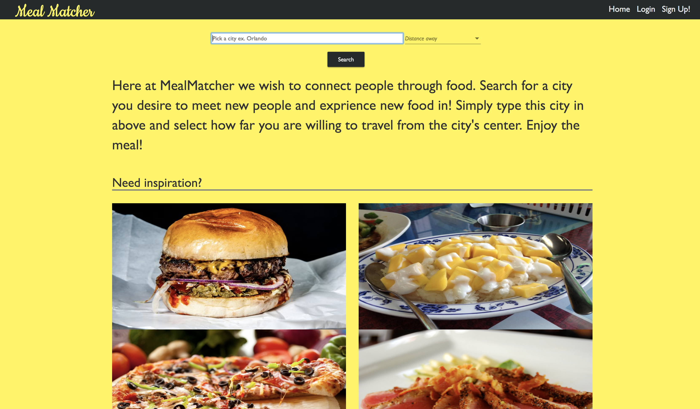
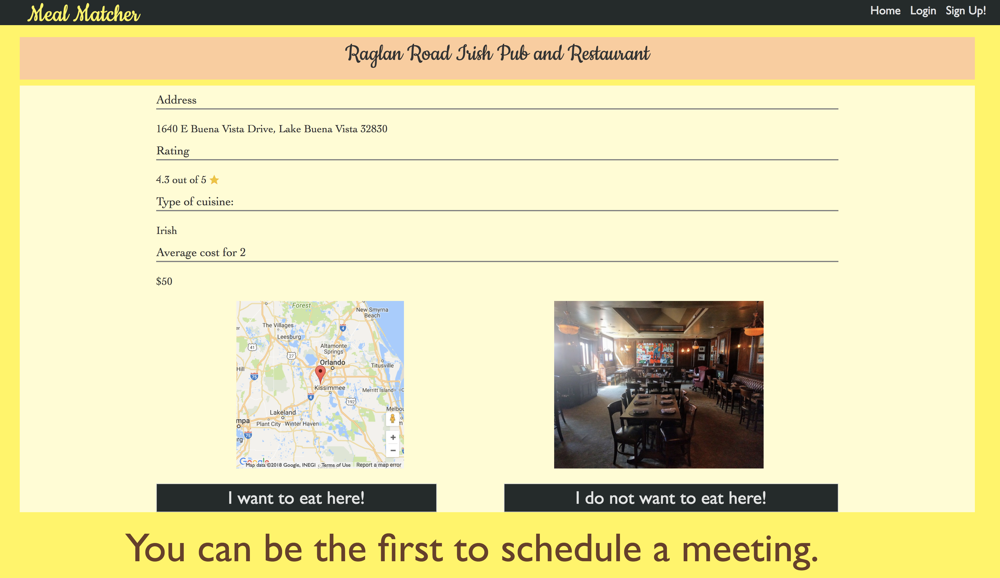

# MealMatcher

Never dine alone.

## Description
This app was created with the idea of connectiong people and food. Solo vacationers as well as business travelers often times do not have the opportunity to eat as certian restaurants due to reservations not allowing for 1 person during main meal times. MealMatcher aims to fix that by connecting people who desire to eat at certian restaurants.

## Live Link

The current live version can be found <a href="http://anthonymengel.com/mealMatcher/">here</a>.

The link to the front-end repo can be found <a href="https://github.com/asmengel/mealmatcher-rework-client">here</a>.

## Screen Shots

## Interested in helping?
This is currently a one person project if you are interested in colloborating on this project you can email me <a href="mailto:anthony@anthonymengel.com?Subject=I%20am%20interested%20in%20helping%20with%20Meal%20Matcher" target="_top">here</a>

